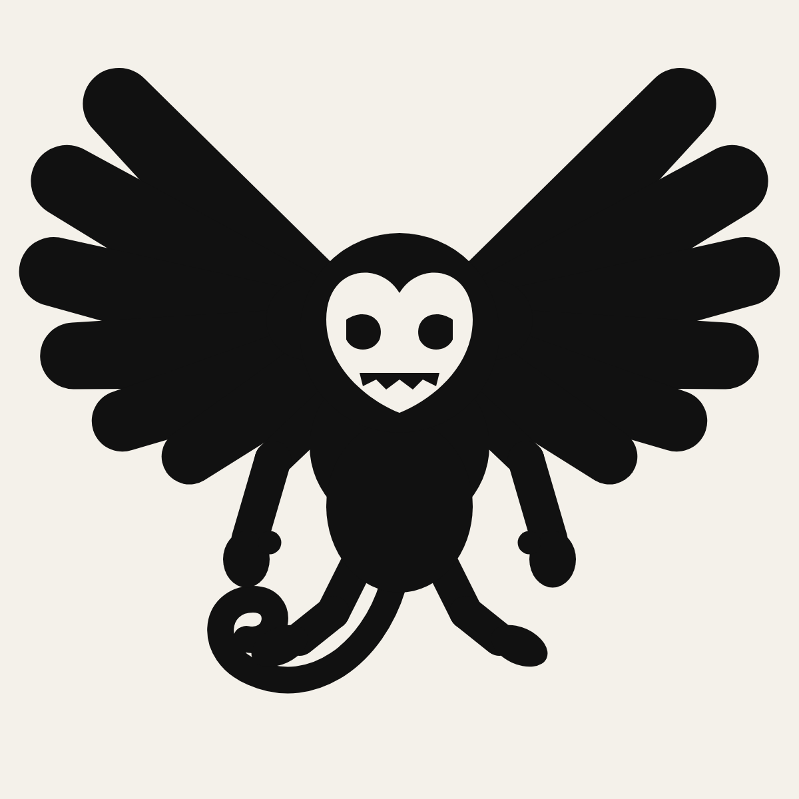

# Flying Monkey — the mark (round three)

A flying monkey, head-on, wings spread. One silhouette with knockouts.



## Why the earlier rounds were not it

- **Round one** was a mascot built from circles and bars, then buried under a type
  system. It read as clip art.
- **Round two** was a winged skull. Research settled that one: the winged skull is
  the Hells Angels' registered Death Head, and the club has sued Alexander McQueen,
  Redbubble and Toys "R" Us over winged-skull merchandise. For a streetwear label
  that is a category you cannot own and a letter you do not want.

## What a finished mark has, and what this one does

The standard is the animal marks that survive as a blacked-out shape at 4 mm:
Puma's leaping cat, Lacoste's crocodile, the Jumpman, the Bacardi bat.

| Principle | Here |
|---|---|
| One silhouette, no outline | One ink. Knockouts are the blank, so the same file prints black on light or Cap Gold on black. |
| Reads blacked out | At 4 mm the ears, the spread, the hanging arms and the tail curl still say winged monkey. |
| A construction, not a style | The Bacardi bat's: symmetrical spread wings, a creature centred, and one asymmetry. |
| One signature detail | The tail, curling under to the left. Always left. |
| Where the menace lives | A skull-white heart face with hollow eyes and a row of teeth. Nothing else is dead. |
| Not someone else's | Not the Death Head (skull), not BAPE (ape head). The body is the mark. |

## Construction

Six feathers a side, root widths 27 to 21, lengths 112 to 68, radiating from one
hidden shoulder. Their bases overlap to the root so the wing is one body with
scalloped tips. Torso is a chest over a belly. Arms are longer than legs, bent
at the elbow, hands as mitts with a thumb. Feet turn out. Head with round ears
over the wing line. Regenerate with `python3 build.py mark`.

## Files

```
mark/
  fm-mark-1c-black.svg   black, knockouts to the blank
  fm-mark-1c-gold.svg    Cap Gold (Pantone 7406 C) on black
  fm-mark-1c-black.png   1200 px preview
sheet/
  fm-mark-sheet.html / .png   grounds, size ladder, placements, the seen-before table
build.py
```

Placements: full front 12 in, 2.5 in from HPS. Left chest 3.5 in from the same
file. Plastisol, 156 mesh, no halftone.

## Still waiting on sign-off

Wordmark, ephemera, unit names and copy come after the mark is agreed. Two inks
maximum when they do: Winkie Black and Cap Gold.
