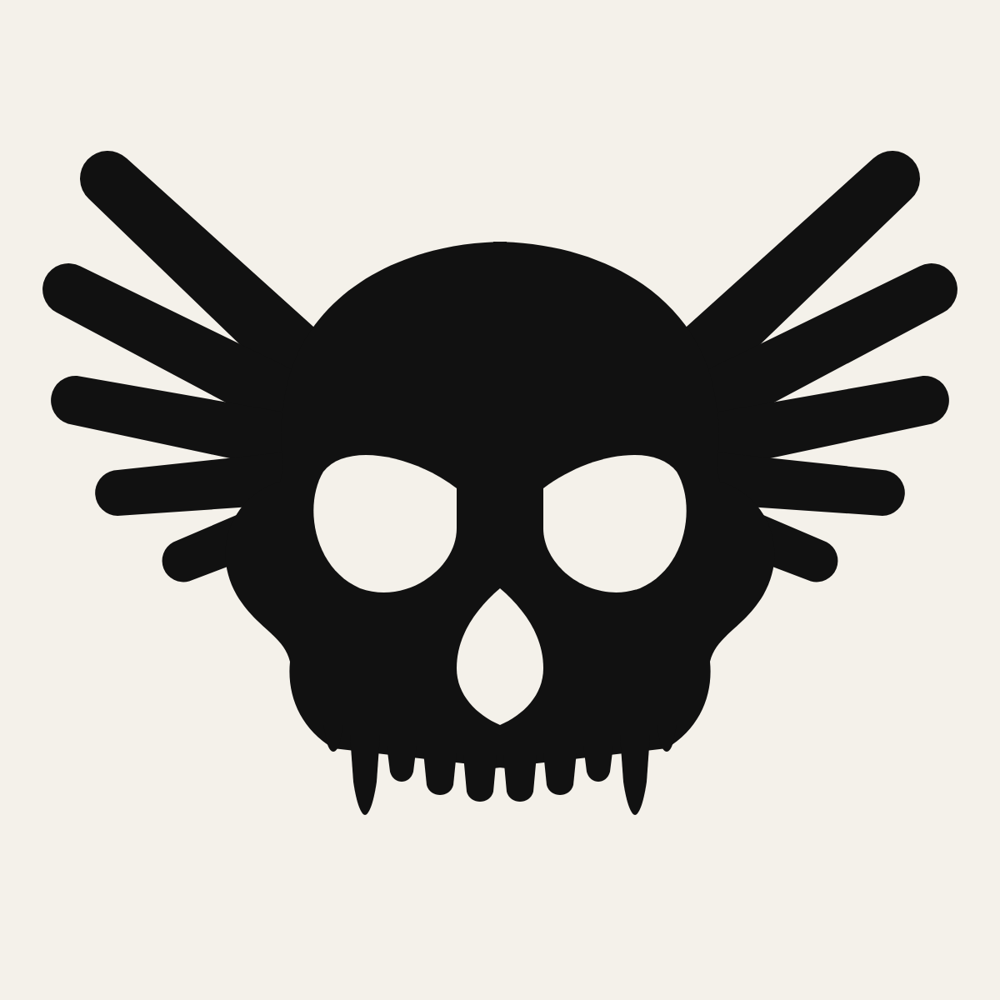

# Flying Monkey — the crest (round two)

A monkey skull with a fan of five feathers a side. One ink with knockouts.



Round one (a constructed circle-and-bar mascot, then a segment-alphabet system)
was rejected and is gone from this folder. It stays in git history only.

## What this is

- **Drawn, not constructed.** The cranium, the inward-tilted sockets, the nasal
  cavity and the arched tooth row are Bézier curves drawn by hand as a right half
  and mirrored. Nothing is a circle.
- **The wing is a fan.** Five feathers a side radiate from one hidden shoulder,
  lengths 108 to 66, root widths 17 to 13, each tapering to 78% at a rounded tip.
  The gaps between feathers open naturally toward the tips and close into a solid
  shoulder at the root.
- **The skull scowls.** Sockets are heavy at the outer top and drop toward the
  nose. Canines are twice the incisor length. Under 3 in the back molar drops so
  the row still prints clean.
- **One ink.** Black on a light blank, or Cap Gold (Pantone 7406 C) on black. The
  knockouts are the blank, so the same file prints both ways.
- **Two cuts.** The crest for full front, full back and posters. The skull alone
  for left chest, sleeve, pins and labels.

## Files

```
mark/
  fm-crest-1c-black.svg      the crest, black, knockouts to the blank
  fm-crest-1c-gold.svg       the crest, Cap Gold on black
  fm-crest-1c-black-sm.svg   under 3 in: molar dropped
  fm-skull-1c-black.svg      skull only
  fm-skull-1c-gold.svg       skull only, Cap Gold
  fm-crest-1c-black.png      1200 px preview
sheet/
  fm-crest-sheet.html / .png grounds, size ladder, placements
build.py                     regenerates everything: python3 build.py mark
```

Placements: full front 12 in, 2.5 in from HPS. Left chest 3.5 in with the
small cut. Plastisol, 156 mesh, no halftone.

## Deliberately not built yet

Wordmark, ephemera, unit names and the institution copy wait until the mark is
agreed. When they come: two inks maximum, Winkie Black and Cap Gold, Space
Grotesk for copy and JetBrains Mono for spec furniture.
